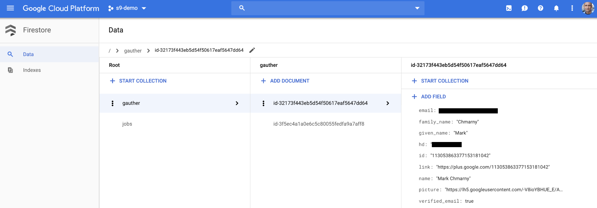

# kdemo

Microservice demo showcasing Knative service request path access configuration and GCP service integration using:

* [Firestore](https://cloud.google.com/firestore/) persistence at global scale
* [Cloud Vision](https://cloud.google.com/vision/) pretrained vision models with AutoML Vision
* [Knative](https://github.com/knative/docs) Kubernetes-based platform to build, deploy, and manage modern serverless workloads


## Demo

https://kdemo.demo.knative.tech/

### Knative URL

To avoid the kind of chicken and an egg situation we are going to first define the `URL` that your application will have when you publish it on Knative. Knative uses convention to build serving URL by combining the deployment name (e.g. `auth`), namespace name (e.g. `demo`), and the pre-configured domain name (e.g. `knative.tech`). The resulting URL, assuming you already configured SSL, should look something like this:

```shell
https://auth.demo.knative.tech
```

### Google OAuth Credentials

In your Google Cloud Platform (GCP) project console navigate to the Credentials section. You can use the search bar, just type `Credentials` and select the option with "API & Services". To create new OAuth credentials:

* Click “Create credentials” and select “OAuth client ID”
* Select "Web application"
* Add authorized redirect URL at the bottom using the fully qualified domain we defined above and appending the `callback` path:
 * `https://auth.demo.knative.tech/auth/callback`
* Click create and copy both `client id` and `client secret`
* CLICK `OK` to save

For ease of use, export the copied client `id` as `DEMO_OAUTH_CLIENT_ID` and `secret` as `DEMO_OAUTH_CLIENT_SECRET` in your environment variables (e.g. ~/.bashrc or ~/.profile)

> You will also have to verify the domain ownership. More on that [here](https://support.google.com/cloud/answer/6158849?hl=en#authorized-domains)


### Google Cloud Firestore

If you haven't used Firestore on GCP before, you will have to enable its APIs. You can find instructions on how to do it [here](https://firebase.google.com/docs/firestore/quickstart) but the basic steps are:

* Go to the [Cloud Firestore Viewer](https://console.cloud.google.com/firestore/data)
* Select `Cloud Firestore in Native mode` from service screen
* Choose your DB location and click `Create Database`

The persisted data in Firestore should look something like this



### App Deployment

To deploy the `kdemo` are are going to:

* [Build the image](#build-the-image)
* [Configure Knative](#configure-knative)
* [Deploy Service](#deploy-service)

#### Build the image

Quickest way to build your service image is through [GCP Build](https://cloud.google.com/cloud-build/). Just submit the build request from within the `kdemo` directory:

```shell
gcloud builds submit \
    --project ${GCP_PROJECT} \
	--tag gcr.io/${GCP_PROJECT}/kdemo:latest
```

The build service is pretty verbose in output but eventually you should see something like this

```shell
ID           CREATE_TIME          DURATION  SOURCE                                   IMAGES                      STATUS
6905dd3a...  2018-12-23T03:48...  1M43S     gs://PROJECT_cloudbuild/source/15...tgz  gcr.io/PROJECT/kdemo SUCCESS
```

Copy the image URI from `IMAGE` column (e.g. `gcr.io/PROJECT/kdemo`).

#### Configure Knative

Before we can deploy that service to Knative, we just need to create Kubernetes secrets and update the `deploy/server.yaml` file

```shell
kubectl create secret generic kdemo \
    --from-literal=OAUTH_CLIENT_ID=${OAUTH_CLIENT_ID} \
    --from-literal=OAUTH_CLIENT_SECRET=${OAUTH_CLIENT_SECRET}
```

Now in the `deploy/server.yaml` file update the `GCP_PROJECT_ID`

```yaml
    - name: GCP_PROJECT_ID
      value: "enter your project ID here"
```

And the external URL of your which we defined at the beginning of this readme in [###knative-url] section.

```yaml
    - name: EXTERNAL_URL
      value: "https://APP-NAME.NAMESPACE.YOUR.DOMAIN"
```

#### Deploy Service

Once done updating service manifest (`deploy/server.yaml`) you are now ready to deploy it.

```shell
kubectl apply -f deployments/service.yaml
```

The response should be

```shell
service.serving.knative.dev "kdemo" configured
```

To check if the service was deployed successfully you can check the status using `kubectl get pods` command. The response should look something like this (e.g. Ready `3/3` and Status `Running`).

```shell
NAME                                          READY     STATUS    RESTARTS   AGE
auth-00002-deployment-5645f48b4d-mb24j        3/3       Running   0          4h
```

You should be able to test the app now in browser using the `URL` you defined above.

## Disclaimer

This is my personal project and it does not represent my employer. I take no responsibility for issues caused by this code. I do my best to ensure that everything works, but if something goes wrong, my apologies is all you will get.

